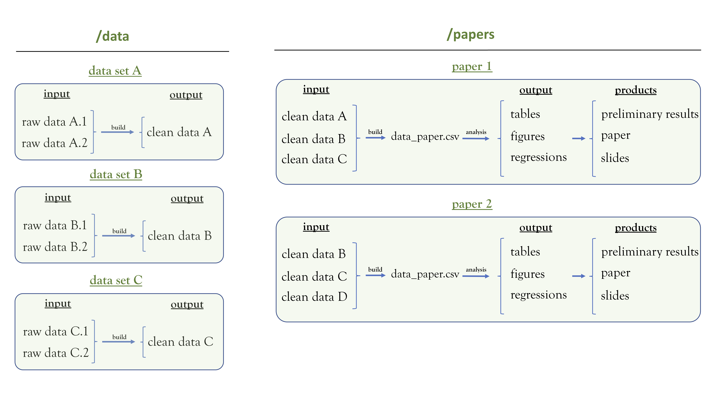

This folder provides an all-encompassing working structure for empirical papers.

It organizes every step of the process: merging and cleaning (several) data sets, performing analyses (tables, figures, regressions), writing the paper and talks themselves, and submitting it to journals.

**To use it**: follow the setup instructions below.

## Summary
0. Workflow
1. Requirements
2. Setup
3. Folders
4. Files
5. Leveraging on Github Capabilities
6. Writing
7. Journal Submissions
8. Principles
9. Further Reading

## 0. Workflow

## 1. Requirements

This workflow requires:
- [Bash](https://www.gnu.org/software/bash/) [Free]
- [Python](https://www.python.org) [Free] 
- [LaTeX](https://www.latex-project.org) [Free]

Other great languages and softwares may also be used.
- [R](https://www.r-project.org) [Free]
- [Stata](https://www.stata.com) [Licensed]
- [Matlab](https://www.mathworks.com/products/matlab) [Licensed]

For now it is only adapted for OSX (Apple) environments. But feel free to adapt it to Windows (and please share it with me!).

## 2. Setup

1. Create or join a cloud folder (e.g. on Dropbox or Drive) where large non-versioned files will reside.
2. Clone this repository to a local folder *outside* the cloud folder.
3. Fill out the correct environment paths in `setup.sh`.
4. Run `sh setup.sh` to create symbolic links to all non-versioned folders.

You're good to go. This repository is now ready for the standard workflow described below.

## 3. Folders

##### `/code`

- Versioned folder containing code that builds data and performs analyses.
- All output data should be redirected into `/output/data/`, with one data file per observation level.
- All output logs should be redirected into `/output/logs/`.
- Other output files should be redirected into `/output/tables/` or `/output/figures/`.
- Keep all code clean and modularized.

    `/sub`
    - Holds modularized code to implement subroutines for build and analysis code.
  
##### `/input`

- Symbolic link to non-versioned folder with input data.
- Any original data source should be included here in clean and normalized form.
- Only include cleaned files. Raw external files should be cleaned in each data source specific folder.
- These data sets will then be manipulated and merged by the files in `/code`.
  
##### `/output`

- Symbolic link to non-versioned folder with output data.
- Holds built data sets in `/output/data/`, to be then used in analysis code.
- Contains all analysis objects generated by files in `/code`.
- Will then serve as source for the generation of `.tex` files inside `/products/`.

##### `/tmp`

- Symbolic link to non-versioned folder with temporary files.
- Contains any temporary file created during the manipulation of input data sets or the analysis routine.

##### `/extra`

- Contains any extra file relevant to the paper.
- Examples: grant materials, previous analyses, submissions.

##### `/products`

- Versioned folder containing files for preliminary results, papers, talks, and others.

    `/sub`
    - Curated set of packages and shortcuts commonly used in Social Science papers and presentations.
## 4. Files

##### `run_paper.py`

- Automates the whole paper construction.
- Runs everything in a pre-specified order, from beginning (building data sets) to end (compiling `.tex` files).
- Keeps clear what should be run when.
- Also cleans `/output` and `/tmp` folders before running other code.

##### `/code/get_input.py`

- Erases any file inside `/input` and copies any original data set from outside sources.
- Ensures consistency across original data generation and data building for paper.

## 5. Leveraging on Github capabilities

- Use issues as tasks. Track it all on a project board named "Tasks".
	- Add tags to tasks to track progress by area. Some template tags included: `build`, `analysis`, `writing`, `review`, `enhancement`, `bug`.
- Name commits following [conventional notation](https://www.conventionalcommits.org).
- Add forward-looking tags and milestones to plan and version work.
	- These help marking relevant releases, such as a minimum viable product (MVP), a paper submission, or a talk.
	- Use [semantic versioning](https://semver.org/) for naming, e.g. `v0.1`, `v1.0.2`.
- Only modify files via pull requests. Use closing keywords to close issues.

## 6. Writing

All writing should be done within the repository to preserve versioning and consistency.

- Keep a set of continuously-updated slides reflecting the current state and vision of the project.
- Sync this repository with online LaTeX editing tools, such as [Overleaf](https://www.overleaf.com/), for simultaneous editing and comments.
	- Follow these instructions to [integrate Overleaf with Dropbox](https://www.overleaf.com/learn/how-to/Dropbox_Synchronization).
	- Sync Overleaf project to a folder `/products/paper`.
	- **Important**: the project's "true" state stays in Github. Thus, things always have to be committed on Github after edits.
- Keep all `.bib` references organized in `/extra/references/library.bib`. See principle about reference manager systems below.

## 7. Journal Submissions

Use this folder and Github for working on reviewing drafts (e.g. after a Revise and Resubmit request).

Flow:
1. Centralize all numbered comments in one document uploaded to `/extra/submissions/journal/comments.txt`.
2. Assign comments to issues with clear tasks described in text. Assign issues to people, add tags, add milestone for "journal resubmission", etc. Add issue numbers below each review comment so that it can be tracked 1:1.
3. Work on issues, add sentences/paragraphs together with commit messages describing changes made to code and writing.
4. As issues start to be closed via PRs, put together a 'release' text, which will feed into letter to the editor and referees.
5. When all is done, set a tag for the release and send it off for the journal.

Use tags: `review`, `build`, `analysis`, `writing`, `negative replies`.

## 8. Principles

- For each new project, start (i) a structured versioned folder, (ii) a task manager project, and (iii) a set of slides.
	1. Copy this folder and use a version control system (e.g. [Git](https://git-scm.com/)).
		* Keep track of multiple authors' edits.
		* No more `report_final_v3.2b_ST_toDelete.tex`.
		* Use branching to work simultaneously on code.
	2. Use Github's issues and projects as a task management system. (For other tools, see [ClickUp](https://clickup.com/), [2Do](https://www.2doapp.com/), [Asana](https://asana.com), [Trello](https://trello.com/), and [JIRA](https://www.atlassian.com/software/jira)).
		* Your email inbox is not a task manager.
		* Tasks should be actionable atoms.
		* Set priorities, assignments, due dates, etc.
		* Only one person should be ultimately responsible for each task.
		* Do regular reviews and cleaning.
	3. Slides
		* Containing the current (summarized) version of the paper.
		* Update it continuously. It will discipline your work.
- Keep two folders: `/papers`, and `/data`, as shown in the workflow.
	1. Data.
		* Each folder within `/data` is a data set.
		* Use the same structure for cleaning these datasets (e.g. `/code`, `/input`, `/output`, `/tmp`)
	2. Papers.
		* Each folder within `/papers` is paper.
		* Use `/main_paper/code/get_input.py` to copy original datasets.
- Use a good text editor (I recommend [Visual Studio Code](https://code.visualstudio.com/), [Sublime Text](https://www.sublimetext.com/), [Notepad ++](https://notepad-plus-plus.org/), or [vim](http://www.vim.org/)).
- Use a modern and flexible communication tool (see [Discord](https://discord.com/) or [Slack](https://slack.com)).
- Use a good reference/citation manager (I recommend [Mendeley](https://www.mendeley.com)). Let Mendeley (1) watch a downloads folder, (2) automatically organize every paper into a separate maintained folder in the cloud (Dropbox, Google Drive, etc.), and (3) keep a .bib file with all formatted citations in a `/references` folder. Let each paper be named "Author - Year - Title" (so you can search for PDFs efficiently). If you have a tablet to read and annotate papers, sync your reader (I recommend [PDF Expert](https://pdfexpert.com/)) to this folder. This way, all your annotations will automatically remain synced with Mendeley.
- Keep documentation lean and clean.
- Keep this folder organized. Your future self thanks your present effort.

## 9. Further Reading

- [Gentzkow & Shapiro (2014) Code and Data for the Social Sciences](https://web.stanford.edu/~gentzkow/research/CodeAndData.pdf)
- [Julian Reif's Stata Coding Guide](https://reifjulian.github.io/guide)
- [Michael Stepner's Coding Style Guide](https://github.com/michaelstepner/healthinequality-code/blob/master/code/readme.md)
- [Gentzkow & Shapiro Lab's Paper Template](https://github.com/gslab-econ/template)
- [Tutorial on how to combine Git and Dropbox](https://github.com/kbjarkefur/GitHubDropBox)
- [Guidelines on how to name git commits](https://www.conventionalcommits.org)
